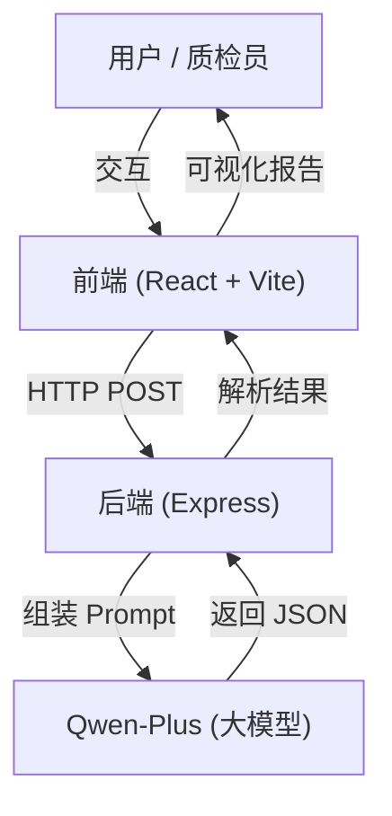

<div align="center">

# GovInsight-AI

**热线工单质量智能检测系统**
**Intelligent Quality Inspection System for Government Service Hotline Work Orders**

[](https://www.gnu.org/licenses/gpl-3.0)


[简体中文](#简体中文) | [English](#english-introduction)

</div>

---

<a name="简体中文"></a>

**GovInsight-AI** 是一个基于 **大语言模型 (LLM)** 的政务热线工单质量检测系统。它旨在解决政务热线（如 12345）中“通话录音”与“话务员录入工单”一致性校验的痛点。

传统的人工质检效率低、标准不一，且难以发现隐蔽的语义篡改。GovInsight-AI 通过自动比对录音转写与工单记录，精准识别关键信息缺失、语义偏差和风险降级等问题，并提供智能化的修正建议，大幅提升质检效率与准确性。

## 📖 项目背景与痛点

在政务服务热线（如 12345）的日常运营中，**工单记录质量**直接关系到群众诉求的办理效率和满意度。然而，传统的人工质检模式面临着巨大挑战：

*   **⚡️ 效率低下**：海量的通话录音和工单记录，人工抽检率通常不足 5%，大量问题工单成为“漏网之鱼”。
*   **📏 标准不一**：不同质检员的主观判断差异大，难以形成统一、公正的评价体系。
*   **🙈 隐蔽篡改**：话务员为了规避考核，可能将“投诉”私自改为“咨询”，或故意漏记群众的激进言辞，人工难以逐一核对录音。
*   **📉 反馈滞后**：质检通常是事后进行（T+1甚至T+7），无法在工单流转前及时拦截和修正。

**GovInsight-AI** 正是为解决上述痛点而生，它将 LLM 的语义理解能力引入质检环节，实现**全量、实时、客观**的智能检测。

## ✨ 核心价值与功能

GovInsight-AI 不仅仅是一个打分工具，更是一个**智能辅助助手**。

### 1. 🔍 多维度智能质检 (Multi-dimensional Inspection)
系统基于以下四个核心维度对工单进行深度扫描：
*   **完整性 (Completeness)**：检测是否遗漏时间、地点、涉事对象、具体诉求等关键要素。
*   **一致性 (Consistency)**：**（核心能力）** 比对录音与工单，发现语义篡改、事实偏差或性质变更（如“投诉”变“咨询”）。
*   **规范性 (Clarity)**：评估表述是否清晰、专业，是否存在语病、歧义或口语化表达。
*   **风险敏感性 (Risk Awareness)**：识别是否忽视了群众的激烈情绪、重复投诉历史或潜在的舆情升级风险。

### 2. 🧠 可解释的 AI 思维链 (Explainable CoT)
拒绝“黑盒”评判！系统会展示 AI 的完整推理过程（Chain of Thought）：
> *"用户在录音中明确提到了‘已经是第三次投诉了’，但工单描述中未记录此信息，这属于关键信息遗漏，且降低了问题的紧迫性..."*
这种可解释性让质检员能够快速复核并信任 AI 的判断。

### 3. 🛡️ 智能分级处置策略 (Intelligent Strategy)
引入**置信度 (Confidence)** 机制，将工单分为三类：
*   **✅ 自动采信 (Auto-Pass)**：置信度 ≥ 0.85 且无风险的工单，直接通过，无需人工介入。
*   **👀 抽检复核 (Sampling)**：置信度在 0.70 - 0.84 之间的工单，进入抽检池。
*   **🚨 强制复核 (Mandatory Review)**：置信度 < 0.70 或存在高风险（如情绪激进）的工单，强制要求人工复核。

### 4. ✍️ 自动修正与对比 (Auto-Revision & Diff)
当发现质量问题时，AI 不仅会报错，还会**自动重写**一份标准的工单。
系统提供直观的 **Diff 视图**，高亮显示原工单与 AI 建议工单的差异，话务员或质检员可一键采纳建议。

## 📸 功能演示

> *（此处建议插入 GIF 动图或截图）*

### 场景一：关键信息缺失
用户在电话中强调了“每天晚上10点到12点施工噪音扰民”，但工单仅记录“反映噪音扰民”。
**AI 识别结果**：扣分（完整性），并建议补充具体时间段。

### 场景二：风险降级（投诉变咨询）
用户愤怒地表示“再不解决我就要去上访”，话务员将其记录为“市民咨询相关政策”。
**AI 识别结果**：**严重警告**（一致性/风险意识），判定为“性质偏差”，建议修正为“投诉”，并标记高风险。

## 🏗️ 系统架构



## 🛠️ 技术栈

*   **前端**: React 19, TypeScript, Tailwind CSS 4, Lucide Icons, Vite 7
*   **后端**: Node.js, Express, OpenAI SDK (Adapter)
*   **AI 模型**: Qwen-Plus (via Aliyun DashScope)
*   **提示词工程**: 5层分层推理逻辑 (评分 -> 置信度 -> 策略 -> 校准 -> 修正)

## 🚀 快速开始

### 1. 环境准备
*   Node.js (v18+)
*   npm 或 yarn
*   阿里云 Qwen API Key (或兼容 OpenAI 格式的其他 LLM Key)

### 2. 启动后端服务
```bash
cd server
# 复制环境变量示例文件
cp .env.example .env

# 编辑 .env 文件，填入您的 QWEN_API_KEY
vim .env 

npm install
node index.js
```
后端默认运行在 `http://localhost:3000`

### 3. 启动前端界面
```bash
cd web
npm install
npm run dev
```
前端默认运行在 `http://localhost:5173`

## 🗺️ 路线图

*   [x] **V0.1**: 基础评分功能 (Basic Scoring)
*   [x] **V0.2**: 置信度评估与分级处置 (Confidence & Bucketing)
*   [x] **V0.3**: UI 重构、条件式修正生成、Mock 演示模式
*   [ ] **V0.4**: 支持批量上传与 CSV 导出
*   [ ] **V0.5**: 集成 RAG (检索增强生成) 以支持本地知识库（如政策法规库）的合规性检测
*   [ ] **V1.0**: 完整的仪表盘 (Dashboard) 与多租户支持

## 📄 许可证

本项目采用 [GNU GPL v3.0](LICENSE) 许可证。

---

<a name="english-introduction"></a>
## English Introduction

**GovInsight-AI** is an open-source intelligent quality inspection system powered by **Large Language Models (LLM)** (specifically Qwen-Plus). It addresses the critical challenge of verification between "Call Transcripts" and "Operator Work Orders" in government service hotlines (e.g., 12345).

By automatically comparing the dialogue with the written record, GovInsight-AI identifies **missing key information**, **semantic deviations**, and **risk downgrading**, providing interpretable scoring and constructive revision suggestions.

### Core Features

*   **Multi-dimensional Inspection**: Completeness, Consistency, Clarity, and Risk Awareness.
*   **Chain of Thought (CoT)**: Displays full reasoning process for interpretable judgments.
*   **Intelligent Strategy**: Auto-Pass for high confidence, Human Review for risks.
*   **Auto-Revision**: Generates standardized revisions with highlighted diffs.

### Quick Start

1.  **Backend**: `cd server` -> `cp .env.example .env` -> `npm install` -> `node index.js`
2.  **Frontend**: `cd web` -> `npm install` -> `npm run dev`

### License
GNU GPL v3.0 License
