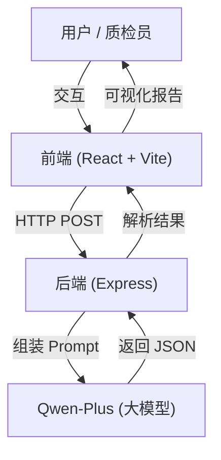
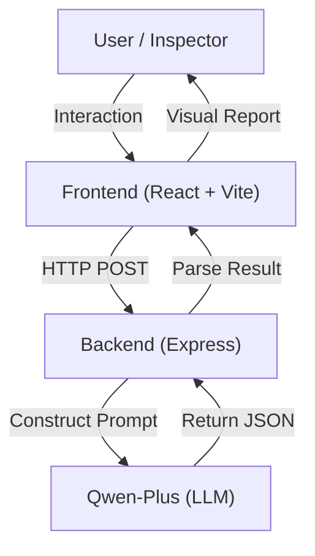

<div align="center">

# GovInsight-AI 热线工单质量智能检测系统

**Intelligent Quality Inspection System for Government Service Hotline Work Orders**

[](CHANGELOG.md)
[](https://www.gnu.org/licenses/gpl-3.0)


[简体中文](#简体中文) | [English](#english-introduction)

</div>

---

<a name="简体中文"></a>

**GovInsight-AI** 是一个基于 **大语言模型 (LLM)** 的政务热线工单质量检测系统。它旨在解决政务热线（如 12345）中“通话录音”与“话务员录入工单”一致性校验的痛点。

传统的人工质检效率低、标准不一，且难以发现隐蔽的语义篡改。GovInsight-AI 通过自动比对录音转写与工单记录，精准识别关键信息缺失、语义偏差和风险降级等问题，并提供智能化的修正建议，大幅提升质检效率与准确性。

## 📖 项目背景与痛点

在政务服务热线（如 12345）的日常运营中，**工单记录质量**直接关系到群众诉求的办理效率和满意度。然而，传统的人工质检模式面临着巨大挑战：

*   **⚡️ 效率低下**：海量的通话录音和工单记录，人工抽检率通常不足 5%，大量问题工单成为“漏网之鱼”。
*   **📏 标准不一**：不同质检员的主观判断差异大，难以形成统一、公正的评价体系。
*   **🙈 隐蔽篡改**：话务员为了规避考核，可能将“投诉”私自改为“咨询”，或故意漏记群众的激进言辞，人工难以逐一核对录音。
*   **📉 反馈滞后**：质检通常是事后进行（T+1甚至T+7），无法在工单流转前及时拦截和修正。

**GovInsight-AI** 正是为解决上述痛点而生，它将 LLM 的语义理解能力引入质检环节，实现**全量、实时、客观**的智能检测。

## ✨ 核心价值与功能

GovInsight-AI 不仅仅是一个打分工具，更是一个**智能辅助助手**。

### 1. 🔍 多维度智能质检 (Multi-dimensional Inspection)
系统基于以下四个核心维度对工单进行深度扫描：
*   **完整性 (Completeness)**：检测是否遗漏时间、地点、涉事对象、具体诉求等关键要素。
*   **一致性 (Consistency)**：**（核心能力）** 比对录音与工单，发现语义篡改、事实偏差或性质变更（如“投诉”变“咨询”）。
*   **规范性 (Clarity)**：评估表述是否清晰、专业，是否存在语病、歧义或口语化表达。
*   **风险敏感性 (Risk Awareness)**：识别是否忽视了群众的激烈情绪、重复投诉历史或潜在的舆情升级风险。

### 2. 🧠 可解释的 AI 思维链 (Explainable CoT)
拒绝“黑盒”评判！系统会展示 AI 的完整推理过程（Chain of Thought）：
> *"用户在录音中明确提到了‘已经是第三次投诉了’，但工单描述中未记录此信息，这属于关键信息遗漏，且降低了问题的紧迫性..."*
这种可解释性让质检员能够快速复核并信任 AI 的判断。

### 3. 🛡️ 智能分级处置策略 (Intelligent Strategy)
引入**置信度 (Confidence)** 机制，将工单分为三类：
*   **✅ 自动采信 (Auto-Pass)**：置信度 ≥ 0.85 且无风险的工单，直接通过，无需人工介入。
*   **👀 抽检复核 (Sampling)**：置信度在 0.70 - 0.84 之间的工单，进入抽检池。
*   **🚨 强制复核 (Mandatory Review)**：置信度 < 0.70 或存在高风险（如情绪激进）的工单，强制要求人工复核。

### 4. ✍️ 自动修正与对比 (Auto-Revision & Diff)
当发现质量问题时，AI 不仅会报错，还会**自动重写**一份标准的工单。
系统提供直观的 **Diff 视图**，高亮显示原工单与 AI 建议工单的差异，话务员或质检员可一键采纳建议。

## 📸 功能演示

> *（此处建议插入 GIF 动图或截图）*

### 场景一：标准高分案例 (Standard High Score)
**案例背景**：市民来电反映幸福家园小区南门路灯损坏，话务员完整记录了时间、地点（含参照物）、损坏数量及具体诉求。
**AI 检测焦点**：
*   **完整性**：自动比对录音中的“两盏”、“南门近超市”等细节，确认无遗漏。
*   **一致性**：确认话务员未歪曲市民的维修诉求。
**AI 研判结果**：
*   **得分**：100 分（优秀）
*   **处置**：高置信度 (High Confidence) -> **自动采信**，无需人工干预。

### 场景二：关键信息缺失 (Missing Key Info)
**案例背景**：市民反映建设路共享单车乱停放，并在录音中反复强调“盲道被堵”且“险些造成盲人受伤”。工单仅记录“影响通行”。
**AI 检测焦点**：
*   **完整性**：识别出“盲道被堵”（重点治理项）和“安全隐患”（险些受伤）在工单中缺席。
*   **风险意识**：指出话务员未标记安全隐患，导致优先级评估偏低。
**AI 研判结果**：
*   **得分**：80 分（合格）
*   **处置**：中置信度 -> **建议人工复核**。
*   **修正建议**：AI 自动补充“堵塞盲道”及“存在安全隐患”描述，并将优先级提升为“Urgent”。

### 场景三：风险降级 (Risk Downgrading)
**案例背景**：市民因化工厂异味问题多次投诉无果，情绪极度激动，扬言“要去拉横幅”、“找媒体曝光”，且提及“孩子住院”。工单仅记录为普通“异味反映”。
**AI 检测焦点**：
*   **风险敏感性**：捕捉到“拉横幅”（群体事件风险）、“找媒体”（舆情风险）及“孩子住院”（健康风险）。
*   **一致性**：判定话务员将“最后通牒”降级为“一般诉求”，属于严重失职。
**AI 研判结果**：
*   **得分**：45 分（存在风险）
*   **处置**：低置信度/高风险 -> **强制人工复核**。
*   **警示**：系统标记为“严重漏报高危风险”，建议立即升级为“特急”工单。

### 场景四：歪曲事实 (Fact Distortion)
**案例背景**：市民明确高喊“我要投诉烧烤店扰民”，话务员却在工单中将其包装为“市民咨询餐饮业经营政策”，试图通过“咨询件”规避“投诉件”的考核。
**AI 检测焦点**：
*   **一致性**：发现录音中的核心意图（投诉/维权）与工单定性（咨询/求助）存在根本性冲突。
*   **性质判定**：识别此类行为为恶劣的“指鹿为马”性质。
**AI 研判结果**：
*   **得分**：35 分（不合格）
*   **处置**：高置信度 -> **建议直接退回重写**。
*   **追责建议**：系统明确指出该工单属于性质恶劣的定性篡改，建议追究话务员责任。


## 🏗️ 系统架构



## 🛠️ 技术栈

*   **前端**: React 19, TypeScript, Tailwind CSS 4, Lucide Icons, Vite 7
*   **后端**: Node.js, Express, OpenAI SDK (Adapter)
*   **AI 模型**: Qwen-Plus (via Aliyun DashScope)
*   **提示词工程**: 5层分层推理逻辑 (评分 -> 置信度 -> 策略 -> 校准 -> 修正)

## 🚀 快速开始

### ⚡️ 自动安装 (推荐)

我们提供了一键启动脚本，可自动安装依赖并启动服务：

```bash
./setup_and_run.sh
```

首次运行前，请确保您已拥有 Node.js 环境。脚本会自动创建配置文件，请随后在 `server/.env` 中填入您的 API Key。

### 手动安装

#### 1. 环境准备
*   Node.js (v18+)
*   npm 或 yarn
*   阿里云 Qwen API Key (或兼容 OpenAI 格式的其他 LLM Key)

### 2. 启动后端服务
```bash
cd server
# 复制环境变量示例文件
cp .env.example .env

# 编辑 .env 文件，填入您的 QWEN_API_KEY
vim .env 

npm install
node index.js
```
后端默认运行在 `http://localhost:3000`

### 3. 启动前端界面
```bash
cd web
npm install
npm run dev
```
前端默认运行在 `http://localhost:5173`

## 🗺️ 路线图

*   [x] **V0.1**: 基础评分功能 (Basic Scoring)
*   [x] **V0.2**: 置信度评估与分级处置 (Confidence & Bucketing)
*   [x] **V0.3**: UI 重构、条件式修正生成、Mock 演示模式
    *   *V0.3.2 (Latest)*: 一键自动化部署脚本、模型配置化、Node.js 运行时自动管理。
    *   *V0.3.1*: Dashboard 布局重构、评分标准 Tooltip、新 Logo 设计。
*   [ ] **V0.4**: 支持批量上传与 CSV 导出
*   [ ] **V0.5**: 集成 RAG (检索增强生成) 以支持本地知识库（如政策法规库）的合规性检测
*   [ ] **V1.0**: 完整的仪表盘 (Dashboard) 与多租户支持

## 📄 许可证

本项目采用 [GNU GPL v3.0](LICENSE) 许可证。

---

<a name="english-introduction"></a>
## English Introduction

**GovInsight-AI** is an open-source intelligent quality inspection system powered by **Large Language Models (LLM)** (specifically Qwen-Plus). It addresses the critical challenge of verification between "Call Transcripts" and "Operator Work Orders" in government service hotlines (e.g., 12345).

Traditional manual inspection is inefficient, inconsistent, and often fails to detect subtle semantic tampering. GovInsight-AI solves this by automatically comparing audio transcripts with work order records, accurately identifying missing key information, semantic deviations, and risk downgrading, while providing intelligent revision suggestions.

### 📖 Background & Pain Points

In the daily operation of government service hotlines (like 12345), the **quality of work order records** directly affects the efficiency of handling public appeals and citizen satisfaction. However, traditional manual quality inspection faces significant challenges:

*   **⚡️ Low Efficiency**: With massive volumes of calls and records, manual sampling rates are typically below 5%, leaving many problematic orders undetected.
*   **📏 Inconsistent Standards**: Subjective judgments vary greatly among different inspectors, making it difficult to form a unified and fair evaluation system.
*   **🙈 Hidden Tampering**: To avoid penalties, operators might privately change "Complaints" to "Consultations" or intentionally omit aggressive language, which is hard to verify without listening to every recording.
*   **📉 Lagging Feedback**: Inspections are usually post-event (T+1 or even T+7), making it impossible to intercept and correct errors before the work order is dispatched.

**GovInsight-AI** was born to solve these pain points by introducing LLM's semantic understanding capabilities into the inspection process, achieving **full-volume, real-time, and objective** intelligent detection.

### ✨ Core Values & Features

GovInsight-AI is not just a scoring tool, but an **Intelligent Assistant**.

#### 1. 🔍 Multi-dimensional Intelligent Inspection
The system performs a deep scan of work orders based on four core dimensions:
*   **Completeness**: Detects omission of key elements like time, location, involved parties, and specific demands.
*   **Consistency** *(Core Capability)*: Compares audio with the work order to find semantic tampering, factual deviations, or qualitative changes (e.g., turning a "Complaint" into a "Consultation").
*   **Clarity**: Evaluates if the expression is clear, professional, and free of grammatical errors, ambiguity, or colloquialisms.
*   **Risk Awareness**: Identifies if the operator ignored intense emotions, repeated complaint history, or potential risks of public opinion escalation.

#### 2. 🧠 Explainable Chain of Thought (CoT)
Reject "Black Box" judgments! The system displays the AI's full reasoning process:
> *"The user explicitly mentioned 'this is the third complaint' in the recording, but this information was not recorded in the work order. This constitutes a key information omission and reduces the urgency of the issue..."*
This explainability allows inspectors to quickly verify and trust the AI's judgment.

#### 3. 🛡️ Intelligent Triage Strategy
Introducing a **Confidence** mechanism to categorize work orders into three types:
*   **✅ Auto-Pass**: Orders with Confidence ≥ 0.85 and no risks are automatically passed without human intervention.
*   **👀 Sampling Review**: Orders with Confidence between 0.70 - 0.84 enter the sampling pool.
*   **🚨 Mandatory Review**: Orders with Confidence < 0.70 or high risks (e.g., aggressive emotions) require mandatory human review.

#### 4. ✍️ Auto-Revision & Diff
When quality issues are detected, the AI not only reports errors but also **automatically rewrites** a standard work order.
The system provides an intuitive **Diff View**, highlighting the differences between the original and the AI-suggested version, allowing operators or inspectors to adopt suggestions with one click.

### Functional Demo Scenarios

> *(GIF or screenshots recommended here)*

#### Scenario 1: Standard High Score
**Context**: A citizen reports a broken street light. The operator records the time, location, and issue accurately.
**AI Detection Focus**:
*   **Completeness**: Verifies details like "two lights" and "south gate near supermarket".
*   **Consistency**: Confirms no distortion of the repair request.
**AI Verdict**:
*   **Score**: 100 (Excellent)
*   **Action**: High Confidence -> **Auto-Pass**.

#### Scenario 2: Missing Key Info
**Context**: A citizen reports shared bikes blocking the sidewalk, repeatedly emphasizing "blocking the blind lane" and "nearly causing injury to a blind person". The work order only records "bikes affecting traffic".
**AI Detection Focus**:
*   **Completeness**: Identifies missing critical details: "blocking blind lane" (priority issue) and "safety hazard".
*   **Risk Awareness**: Flags the failure to mark the safety hazard.
**AI Verdict**:
*   **Score**: 80 (Qualified)
*   **Action**: Medium Confidence -> **Human Review Suggested**.
*   **Revision**: AI automatically adds "blocking blind lane" and "safety hazard", upgrading priority to "Urgent".

#### Scenario 3: Risk Downgrading
**Context**: A citizen complains about chemical odors for the 3rd time, threatening to "protest with banners" and mentioning "child hospitalized". The operator records it as a standard "odor complaint".
**AI Detection Focus**:
*   **Risk Awareness**: Captures high-risk keywords: "protest" (mass incident risk), "media exposure" (public opinion risk), and "child hospitalized" (health risk).
*   **Consistency**: Determines the operator downgraded a "final ultimatum" to a "general request", a serious dereliction of duty.
**AI Verdict**:
*   **Score**: 45 (Risk)
*   **Action**: Low Confidence / High Risk -> **Mandatory Human Review**.
*   **Alert**: System flags "Serious Omission of High Risk", suggesting an immediate upgrade to "Emergency".

#### Scenario 4: Fact Distortion
**Context**: A citizen explicitly shouts "I want to file a complaint about noise", but the operator records it as "Citizen consulting on catering policies" to avoid a complaint record.
**AI Detection Focus**:
*   **Consistency**: Detects a fundamental conflict between the core intent (Complaint) and work order type (Consultation).
*   **Nature Judgment**: Identifies this as malicious "calling a stag a horse" (fact distortion).
**AI Verdict**:
*   **Score**: 35 (Unqualified)
*   **Action**: High Confidence -> **Reject & Rewrite**.
*   **Accountability**: System explicitly identifies malicious tampering and suggests accountability measures.

### System Architecture



1.  **Frontend**: Built with React & Vite, providing an interactive dashboard for inspectors to view transcripts, work orders, and AI analysis results side-by-side.
2.  **Backend**: A lightweight Express server that handles API requests, constructs context-aware prompts (injecting history factors), and communicates with the LLM provider.
3.  **Core Engine**: Powered by Qwen-Plus (via Aliyun DashScope), performing the 5-layer reasoning process to generate scores, confidence levels, and revisions.

### Tech Stack

*   **Frontend**: React 19, TypeScript, Tailwind CSS 4, Lucide Icons, Vite 7
*   **Backend**: Node.js, Express, OpenAI SDK (Adapter)
*   **AI Model**: Qwen-Plus (via Aliyun DashScope)
*   **Prompt Engineering**: 5-layer reasoning logic (Scoring -> Confidence -> Strategy -> Calibration -> Revision)

### Quick Start

1.  **Backend**: `cd server` -> `cp .env.example .env` -> `npm install` -> `node index.js`
2.  **Frontend**: `cd web` -> `npm install` -> `npm run dev`

### License
GNU GPL v3.0 License
